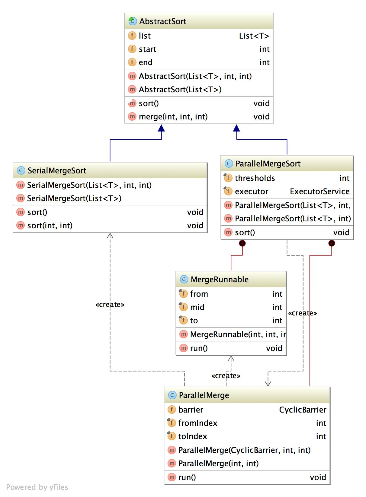

Basic Requirement
============================
Normally Merge sort is Sequential and single threaded which takes O(nlogn) time with O(n) extra space during merging. The idea to convert create a AbstractSort class which will be extended to Parallel or Serial Merge Sort. Based on number of items you have any list you pick one or the other. Parallel Merge sort also take a threshold value, below of which it will perform same a serial sort.

Class Diagram
============================

Prerequisite
============================
##### 1. JDK 1.6
##### 2. Maven 3.0.x

Build
============================
##### 1. Check out the Git repository
    git clone https://github.com/deyindra/MergeSort.git

##### 2. Run following maven command to build the project
    mvn clean install

Benchmarking
============================
Please run the TestBenchMark to get the bench mark results between Parallel and Serial Merge sort. This is automatically run when somebody will be executing mvn clean install. Please open benchmark-lists.html in order to compare the results.

